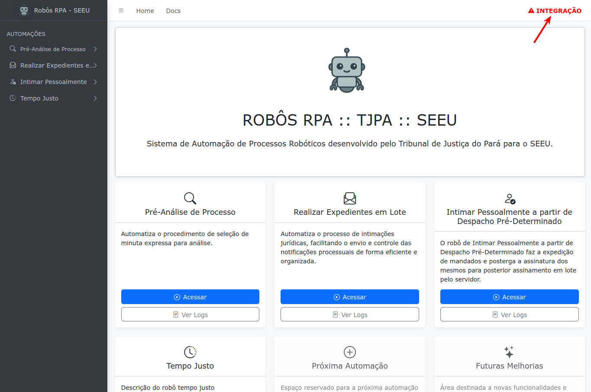
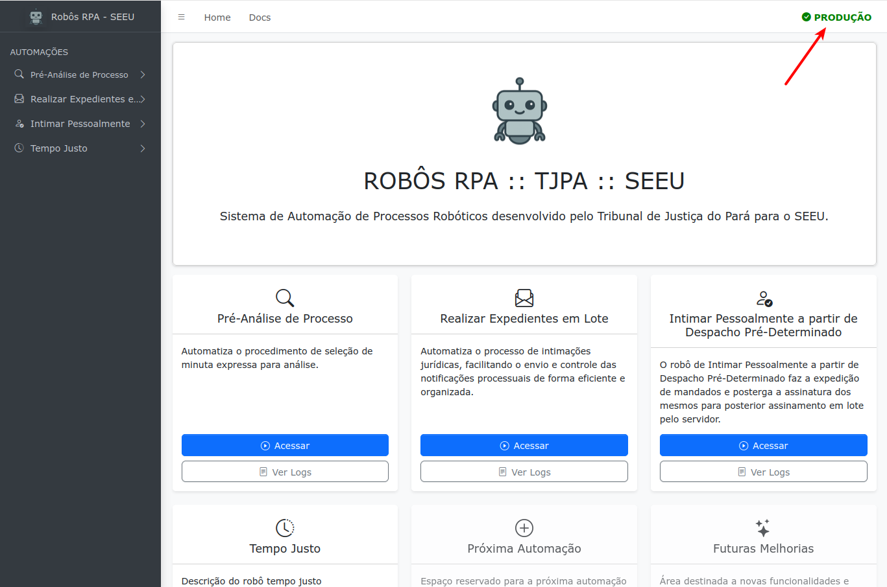

Ambientes
=========

A aplicação exibe o ambiente configurado quando é iniciada para situar o usuário e possivelmente evitar
erros. O nome do ambiente aparece na barra de navegação com coloração específica.

  **URL configurada: https://seeuintegra.pje.jus.br**

  **URL configurada: https://seeu.pje.jus.br**
