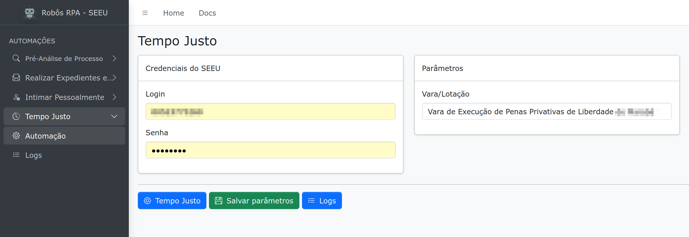

Automação
=========

Todos os robôs possuem a mesma tela de execução contendo um painel com o formulário de login do
usuário do SEEU e outro painel com parâmetros que podem variar de acordo com a automação.

O botão com o nome da automação inicia a execução da mesma. O botão ``Salvar parâmetros`` salva os
dados do painel com os parâmetros para futuras execuções da automação.

.. warning:: Salvar parâmetros de uma automação não executa a mesma.

.. note:: Ao executar uma automação os parâmetros da mesma são salvos automaticamente.

Por exemplo, a tela de automação
do robô Tempo Justo é a seguinte. Todos os campos são obrigatórios.

.. warning:: Todos os robôs possuem o parâmetro Vara/Lotação que é a unidade do usuário ao qual a
             automação vai operar. Escolher a unidade correta é fundamental para correta execução de
             uma automação.
