Intimação Jurídica
==================

Intimar Advogado
----------------

É necessário ter sido cadastrado previamente um agrupador **INTIMAR ADVOGADO(A)**.

Depois de logar no sistema deve-se clicar na aba **Análise de Juntadas**.

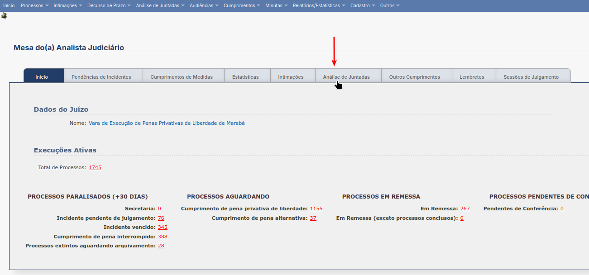

  Aba Análise de Juntadas

Em seguida no *link* **Retorno de Conclusão**.

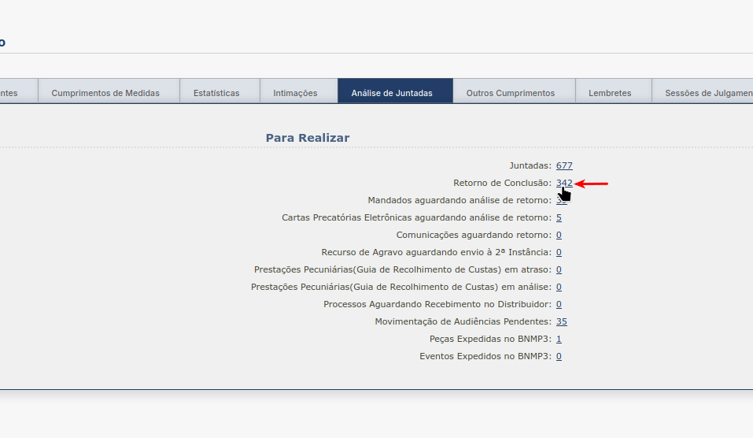

  Link Retorno de Conclusão

Ao rolar para o final da página deve-se clicar no botão de **Análise Múltipla**.

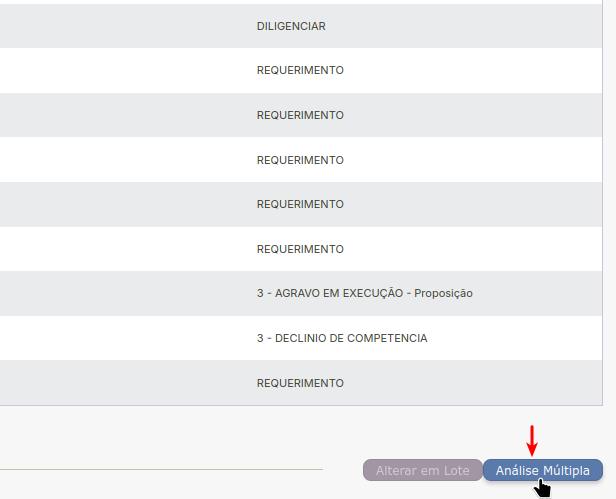

  Botão para Análise Múltipla

Após selecionar o agrupador **INTIMAR ADVOGADO(A)** clica-se no botão **Filtrar**.

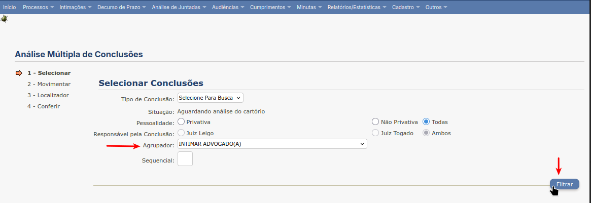

  Agrupador Intimar Advogado

Para cada processo na lista deve-se verificar se está concluso, ou não, via formulário no *link*
**Análise de Juntadas** ➜ **Análise de Conclusões** ➜ **Processos Remetidos p/ Conclusão**.

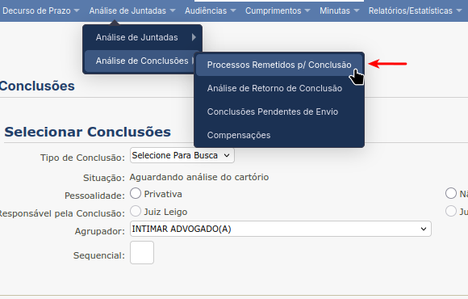

  Acesso ao formulário de consulta de processos não conclusos

Em seguida, utilizando os números dos processos do agrupador, verificar se cada processo está
concluso, ou não.

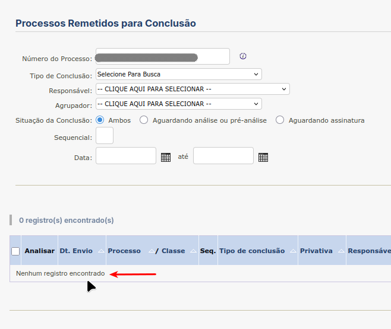

  Verificação de Processo Não Concluso

Selecionar cada processo não concluso e clicar no botão **Próximo passo >**.

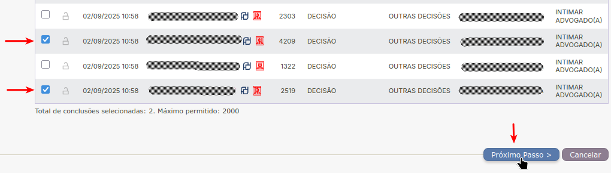

  Seleção de processos não conclusos

Em seguida marcar a caixa **promovido/advogado**, selecionar o prazo **Estipular em Dias** e preencher
a caixa de texto com **5** (dias). Depois clicar no botão **Próximo passo >**.

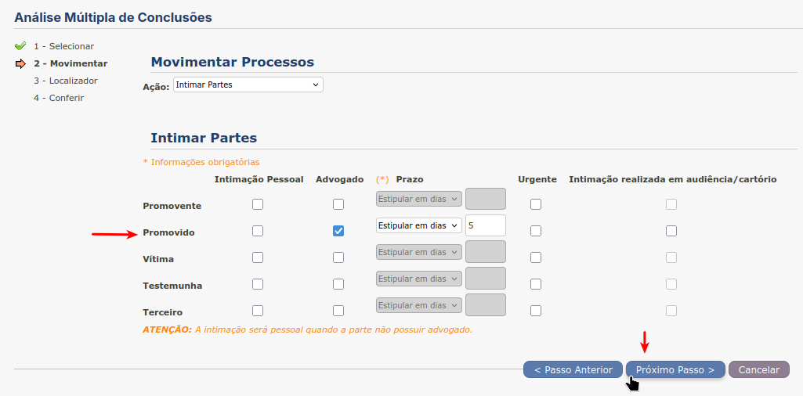

  Realizar Intimação Advogado

Na tela de **Cadastro de Localizador** clica-se no botão **Próximo Passo >**.

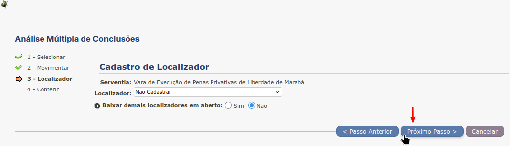

  Cadastro de Localizador

Na tela de **Conferir** clica-se no botão **Salvar** e se não acontecer nenhum erro, os processos são
movimentados e os advogados, intimados.

.. figure:: _static/intimacao_juridica/intimacao_advogado_salvar.png
  :class: data-fb

  Salvar e movimentar processos

Intimar Defensoria Pública
--------------------------

É necessário ter sido cadastrado previamente um agrupador **INTIMAR DEFENSORIA PÚBLICA**.

O procedimento é idêntico ao de Intimar Advogado, porém o agrupador é diferente.

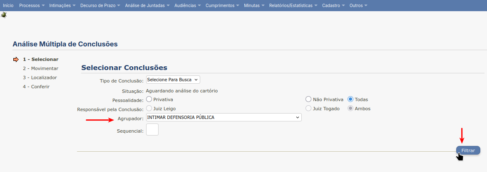

  Agrupador Intimar Defensoria

E a ação de movimentação é **Realizar Remessa**.

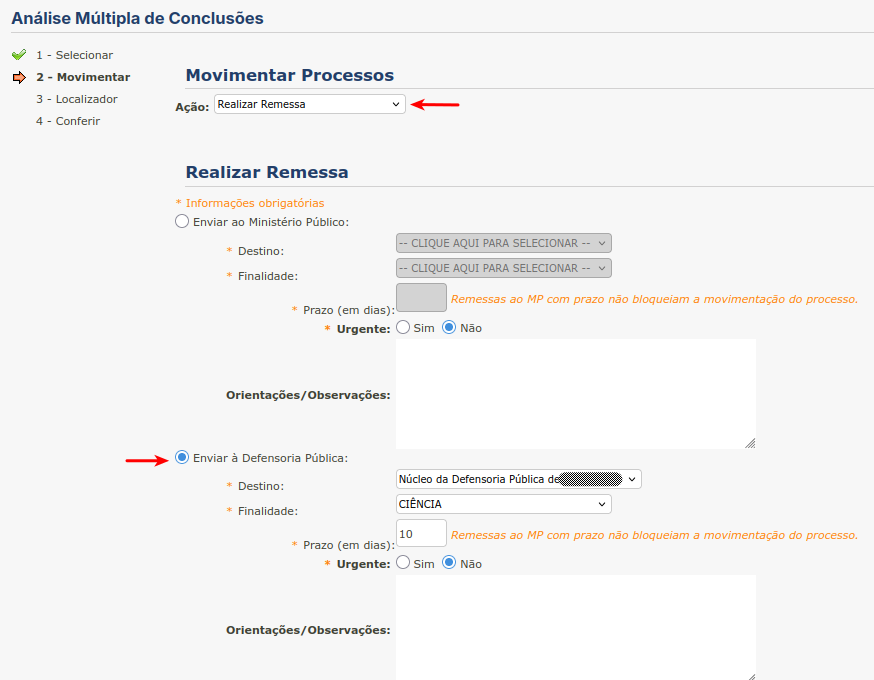

  Realizar Remessa Defensoria Pública

Ciência ao Ministério Público e ao Advogado
-------------------------------------------

É necessário ter sido cadastrado previamente um agrupador **CIÊNCIA AO MINISTÉRIO PÚBLICO E AO ADVOGADO**.

O procedimento é idêntico ao de Intimar Defensoria Pública, porém o agrupador é diferente.

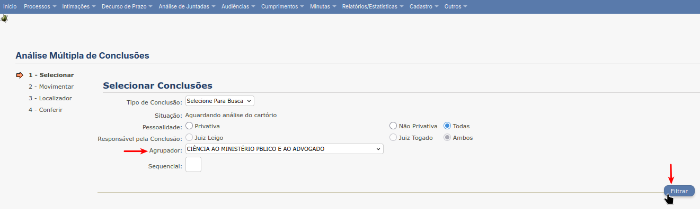

  Agrupador Ciência ao Ministério Público e ao Advogado

A realização de remessa é diferente.

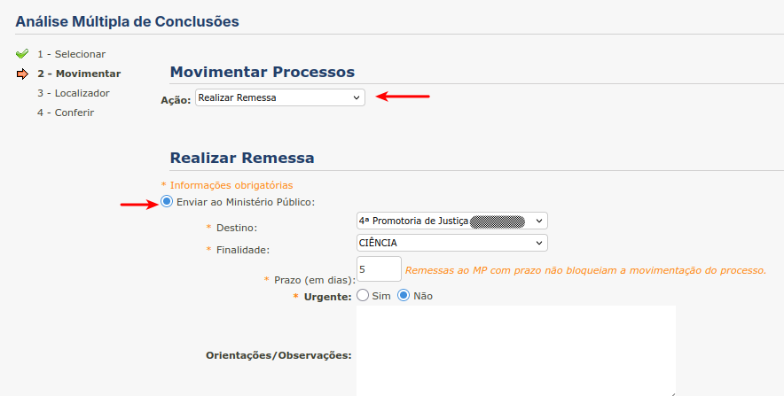

  Realizar Remessa Ciência ao Ministério Público e ao Advogado

O procedimento não termina ao clicar no botão **Salvar**: deve-se marcar o botão de rádio **Continuar Movimentando (Sim)**.

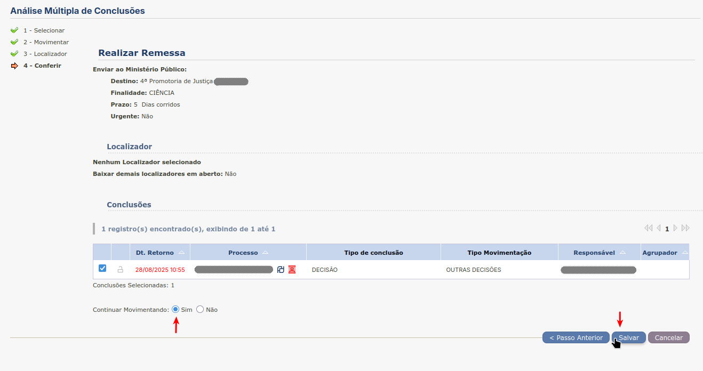

  Continuar movimentação

Na tela de **Adicionar Arquivos** deve-se clicar no botão **Próximo Passo >**.

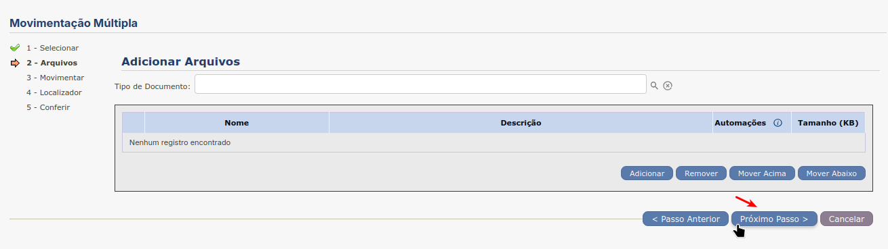

  Adicionar arquivos

A tela seguinte preencher os campos para **Intimação de Advogado**.

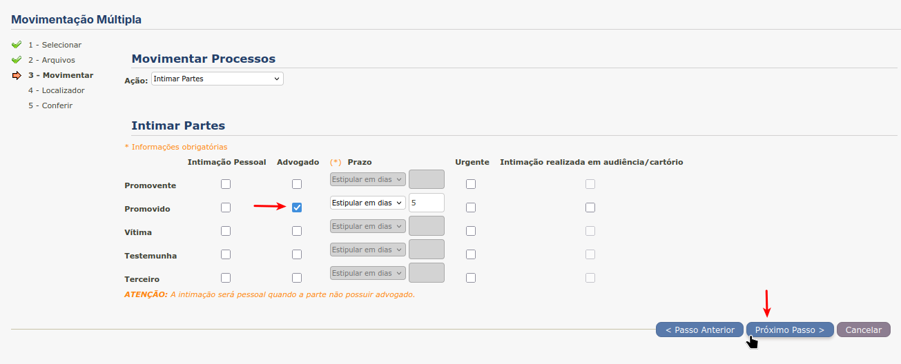

O procedimento de movimentação múltipla termina clicando no botão **Salvar**.

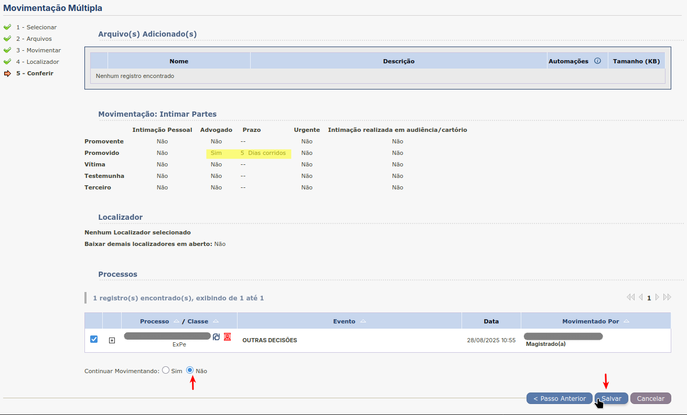

  Salvar e concluir movimentação múltipla

Ciência ao Ministério Público e a Defensoria Pública
----------------------------------------------------

É necessário ter sido cadastrado previamente um agrupador **CIÊNCIA AO MINISTÉRIO PÚBLICO E DEFENSORIA PÚBLICA**.

O procedimento é Ciência ao Ministério Público e ao Advogado, porém o agrupador é diferente.

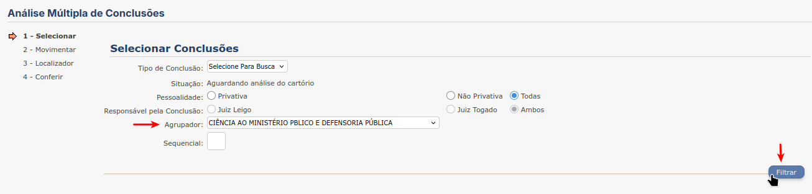

  Agrupador Ciência ao Ministério Público e Defensoria Pública
