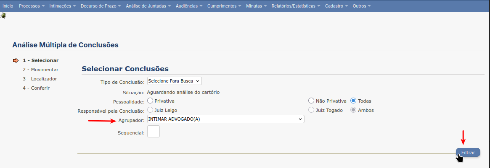
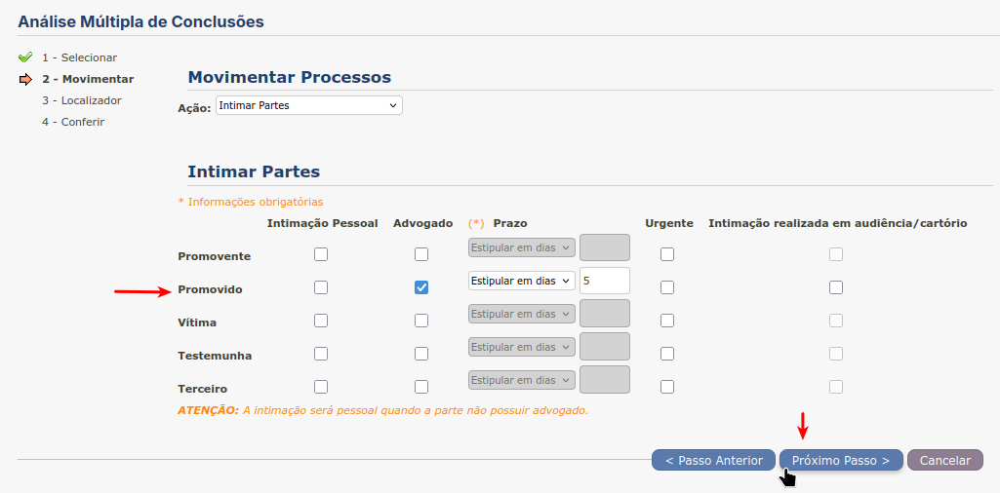
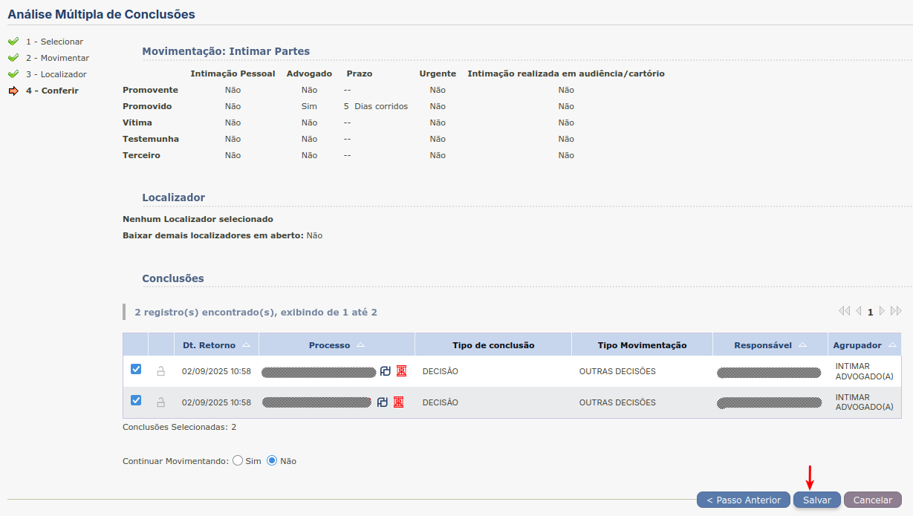

Intimação Jurídica
==================

Intimar Advogado
----------------

É necessário ter sido cadastrado previamente um agrupador **INTIMAR ADVOGADO(A)**.

Depois de logar no sistema deve-se clicar na aba **Análise de Juntadas**.

.. figure:: _static/intimacao_juridica/aba_juntadas.png
  :class: data-fb

  Aba Análise de Juntadas

Em seguida no *link* **Retorno de Conclusão**.

.. figure:: _static/intimacao_juridica/retorno_conclusao.png
  :class: data-fb

  Link Retorno de Conclusão

Ao rolar para o final da página deve-se clicar no botão de **Análise Múltipla**.

.. figure:: _static/intimacao_juridica/analise_multipla.png
  :class: data-fb

  Botão para Análise Múltipla

Após selecionar o agrupador **INTIMAR ADVOGADO(A)** clica-se no botão **Filtrar**.

  Filtrar pelo agrupador

Para cada processo na lista deve-se verificar se está concluso, ou não, via formulário no *link*
**Análise de Juntadas** ➜ **Análise de Conclusões** ➜ **Processos Remetidos p/ Conclusão**.

.. figure:: _static/intimacao_juridica/processos_remetidos_conclusao.png
  :class: data-fb

  Acesso ao formulário de consulta de processos não conclusos

Em seguida, utilizando os números dos processos do agrupador, verificar se cada processo está
concluso, ou não.

.. figure:: _static/intimacao_juridica/processo_nao_concluso.png
  :class: data-fb

  Verificação de Processo Não Concluso

Selecionar cada processo não concluso e clicar no botão **Próximo passo >**.

.. figure:: _static/intimacao_juridica/proximo_passo.png
  :class: data-fb

  Seleção de processos não conclusos

Em seguida marcar a caixa **promovido/advogado**, selecionar o prazo **Estipular em Dias** e preencher
a caixa de texto com **5** (dias). Depois clicar no botão **Próximo passo >**.

  Intimar Advogado

Na tela de **Cadastro de Localizador** clica-se no botão **Próximo Passo >**.

.. figure:: _static/intimacao_juridica/localizador.png
  :class: data-fb

  Cadastro de Localizador

Na tela de **Conferir** clica-se no botão **Salvar** e se não acontecer nenhum erro, os processos são
movimentados e os advogados, intimados.

  Salvar e movimentar processos
