Intimar Pessoalmente
====================

O robô de Intimar pessoalmente faz a expedição de mandados e posterga a assinatura para que futuramente
o servidor faça a assinatura dos mesmos em lote.

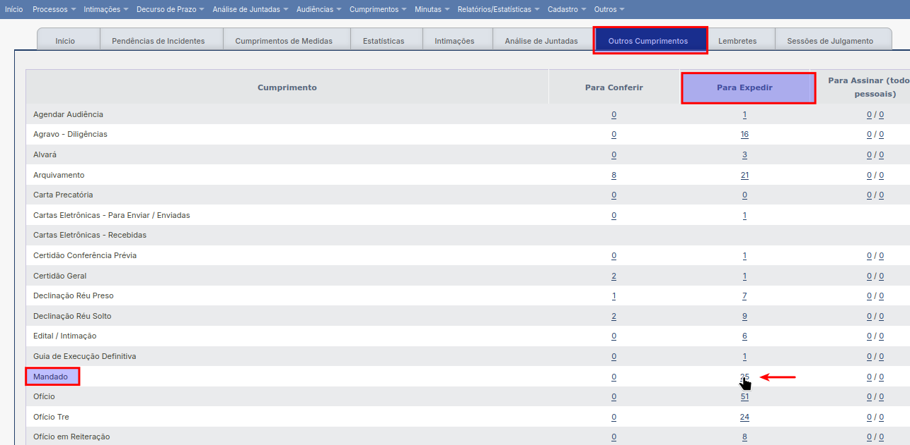

  Mandados para expedir

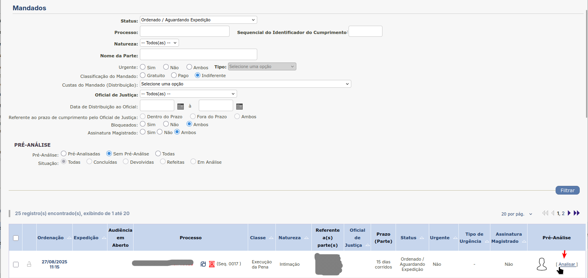

  Analisar processo

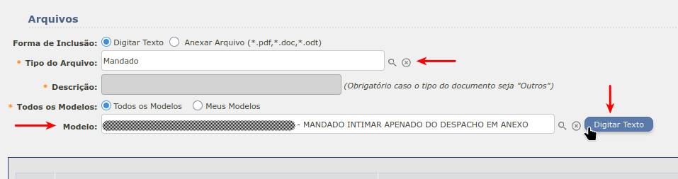

  Modelo Mandado

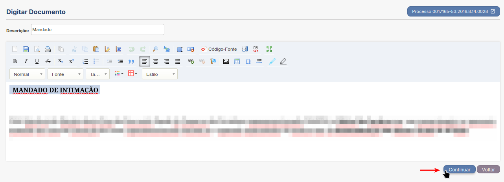

  Mandado Intimação

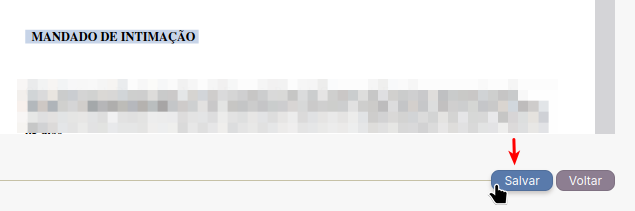

  Salvar Mandado

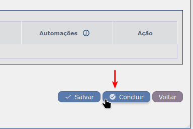

  Concluir

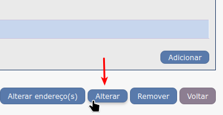

  Alterar

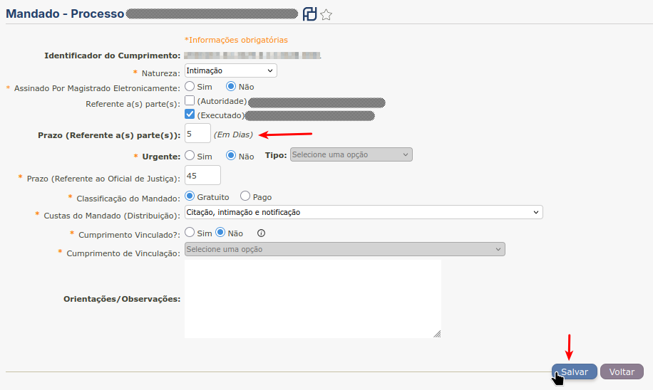

  Alterar Mandado

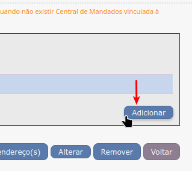

  Adicionar

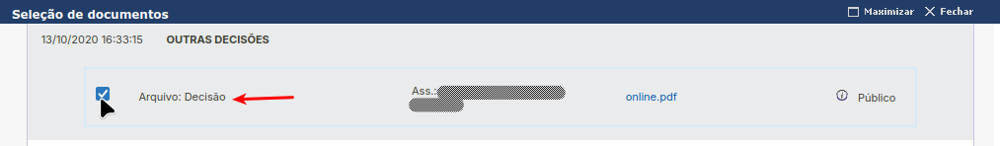

  Arquivo Decisão

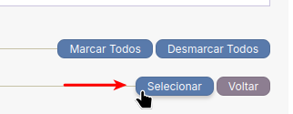

  Selecionar Decisão

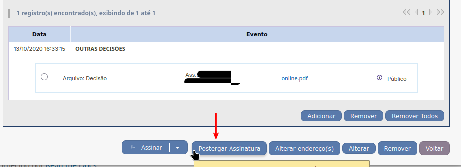

  Postergar Assinatura
