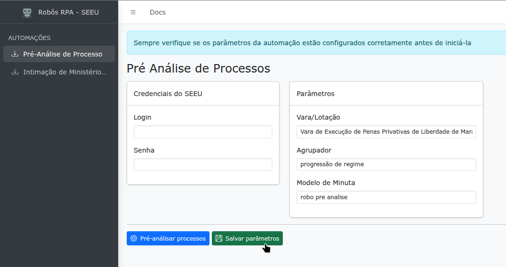
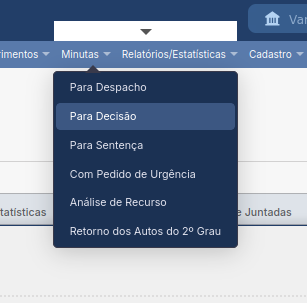
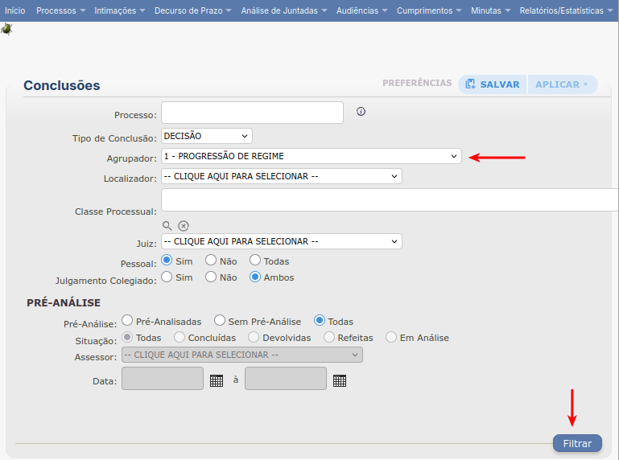
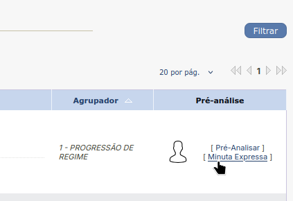
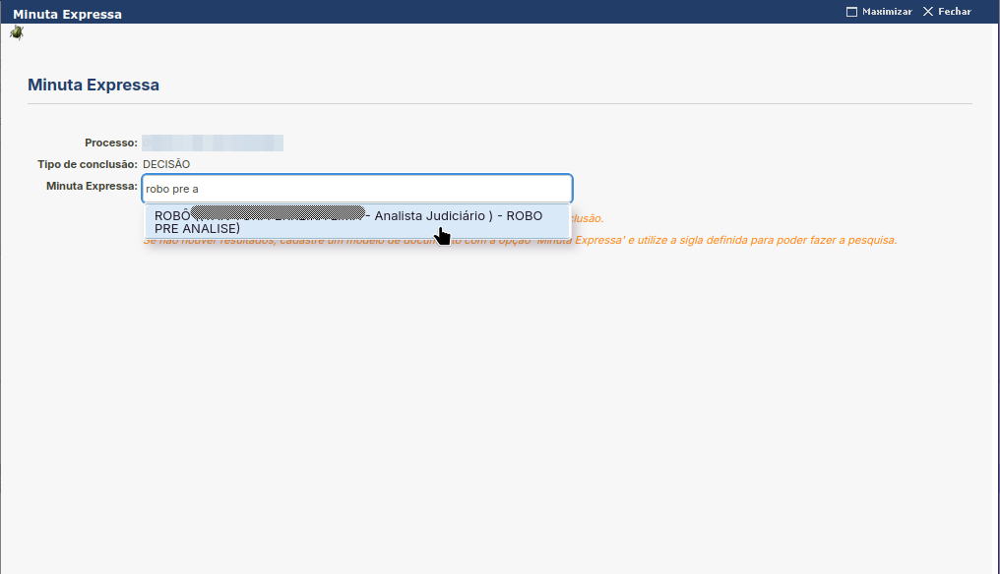
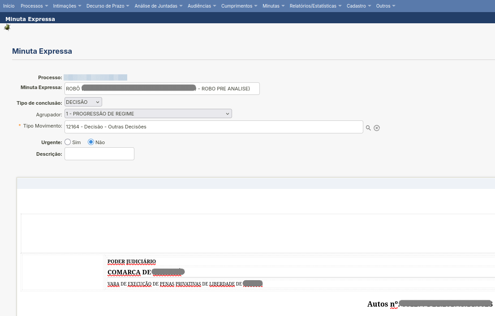

Pré-Análise de Processo
=======================

O robô de pré-analise de processo loga no sistema SEEU utilizando as credenciais fornecidas e
seleciona a vara definida no parâmetro `Vara`.

  Parâmetros

Em seguida o robô avança automaticamente para página de conclusões, seleciona o agrupador definido
no parâmetro `Agrupador`, filtra os registros, clica em minuta expressa e finalmente seleciona o
modelo de minuta definido no parâmetro `Modelo de minuta`.

  Menu decisão

  Conclusões

  Minuta expressa

  Modelo minuta

  Pré-Análise

