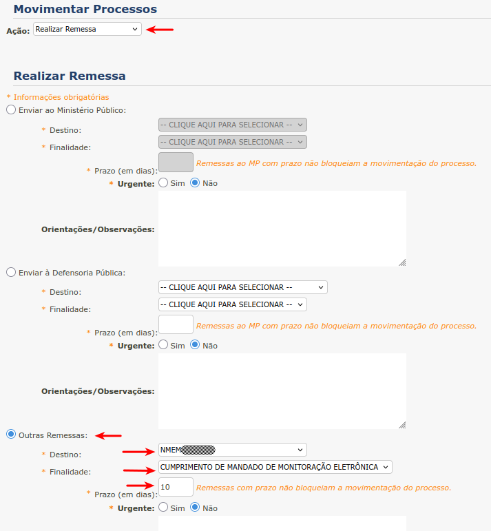

Realizar Expedientes em Lote
============================

O robô de Realizar Expedientes em Lote opera em agrupadores pré-cadastrados e em grupos de processos
organizados por esses agrupadores.

Cada agrupador define uma sequência de movimentações que deve ser aplicada a um grupo de processos. Por exemplo,
o agrupador **1 - SAIDA TEMPORARIA - NMEM; COMPLEXO; ciencia MP; ADVOGADO** com 5 (cinco) processos
executa as seguintes movimentações em todos esses processos (os 5 processos passam por 4 movimentações):

  - NMEM (Movimentação dos processos de acordo com a lógica de Núcleo de Monitoramento)
  - COMPLEXO (Movimentação dos processos de acordo com a lógica do Complexo Penitenciário)
  - ciencia MP (Movimentação dos processos de acordo com a lógica de Ciência ao MP)
  - ADVOGADO (Movimentação dos processos de acordo com a lógica de Intimação do Advogado)

Agrupadores homologados
-----------------------

  - 1 - DOMICILIAR - C Alvaras; NMEM; COMPLEXO; ciencia MP; ADVOGADO; Equipe
  - 1 - DOMICILIAR - C Alvaras; NMEM; COMPLEXO; ciencia MP; ciencia DP; Equipe
  - 1 - IMEDIATO - Intimacao ADVOGADO
  - 1 - IMEDIATO - MANDADO 1
  - 1 - IMEDIATO - Manifestacao DP
  - 1 - IMEDIATO - Manifestacao MP
  - 1 - IMEDIATO - OFICIAR
  - 1 - SAIDA TEMPORARIA - NMEM; COMPLEXO; ciencia MP; ADVOGADO
  - 1 - SAIDA TEMPORARIA - NMEM; COMPLEXO; ciencia MP; ciencia DP
  - 2 - PROGRESSAO Aberto - C Alvaras; COMPLEXO; ciencia MP; ciencia DP; Declinacao Reu Solto
  - 2 - PROGRESSAO Aberto - C Alvaras; COMPLEXO; ciencia MP; ciencia DP; Equipe
  - 2 - PROGRESSAO S.A - C Alvaras; NMEM; COMPLEXO; ciencia MP; ADVOGADO
  - 2 - PROGRESSAO S.A - C Alvaras; NMEM; COMPLEXO; ciencia MP; ciencia DP

.. warning:: O prazo é de 1 (um) dia para a movimentação **C Alvaras** para os seguintes agrupadores

  - **1 - DOMICILIAR - C Alvarás; NMEM; COMPLEXO; ciência MP; ADVOGADO; Equipe**
  - **1 - DOMICILIAR - C Alvaras; NMEM; COMPLEXO; ciencia MP; ciencia DP; Equipe**
  - **2 - PROGRESSÃO Aberto - C Alvarás; COMPLEXO; ciência MP; ciência DP; Declinação Réu Solto**
  - **2 - PROGRESSÃO Aberto - C Alvarás; COMPLEXO; ciência MP; ciência DP; Equipe**

.. warning:: O prazo é de 2 (dois) dias para a movimentação **C Alvaras** para os seguintes agrupadores

  - **2 - PROGRESSAO S.A - C Alvaras; NMEM; COMPLEXO; ciencia MP; ADVOGADO**
  - **2 - PROGRESSAO S.A - C Alvaras; NMEM; COMPLEXO; ciencia MP; ciencia DP**

C Alvaras (Central de Alvarás)
------------------------------

O prazo para a movimentação Central de Alvarás varia dependendo da finalidade:

  - **DECISÃO DE BENEFICIO PARA CUMPRIMENTO.** Prazo de 2 (dois) dias.
  - **CUMPRIMENTO DE ALVARÁ DE SOLTURA.** Prazo de 1 (um) dia.

.. figure:: _static/realizar_expedientes_lote/c_alvaras_beneficio.png
  :class: data-fb

  Campos para a movimentação C Alvaras com finalidade DECISÃO DE BENEFICIO PARA CUMPRIMENTO

.. note:: Para a finalidade **DECISÃO DE BENEFICIO PARA CUMPRIMENTO** o prazo é de 2 (dois) dias

.. figure:: _static/realizar_expedientes_lote/c_alvaras_soltura.png
  :class: data-fb

  Campos para a movimentação C Alvaras com finalidade CUMPRIMENTO DE ALVARÁ DE SOLTURA

.. note:: Para a finalidade **CUMPRIMENTO DE ALVARÁ DE SOLTURA** o prazo é de 1 (um) dia

NMEM (Núcleo de Monitoramento)
------------------------------

  Campos para a movimentação NMEM

COMPLEXO (Complexo Penitênciário)
---------------------------------

.. figure:: _static/realizar_expedientes_lote/complexo.png
  :class: data-fb

  Campos para a movimentação COMPLEXO

ciencia MP (Ciência ao Ministério Público)
------------------------------------------

.. figure:: _static/realizar_expedientes_lote/ciencia_mp.png
  :class: data-fb

  Campos para a movimentação ciencia MP

ADVOGADO (Intimar Advogado)
---------------------------

.. figure:: _static/realizar_expedientes_lote/advogado.png
  :class: data-fb

  Campos para a movimentação ADVOGADO

Equipe (Equipe Interdisciplinar)
--------------------------------

.. figure:: _static/realizar_expedientes_lote/equipe.png
  :class: data-fb

  Campos para a movimentação Equipe

ciencia DP (Ciência à Defensoria Pública)
-----------------------------------------

.. figure:: _static/realizar_expedientes_lote/ciencia_dp.png
  :class: data-fb

  Campos para a movimentação ciencia DP

Mandado
-------

.. figure:: _static/realizar_expedientes_lote/mandado.png
  :class: data-fb

  Campos para a movimentação Mandado

Manifestacao DP (Manifestação à Defensoria Pública)
---------------------------------------------------

.. figure:: _static/realizar_expedientes_lote/manifestacao_dp.png
  :class: data-fb

  Campos para a movimentação Manifestacao DP

Manifestacao MP (Manifestação ao Ministério Público)
----------------------------------------------------

.. figure:: _static/realizar_expedientes_lote/manifestacao_mp.png
  :class: data-fb

  Campos para a movimentação Manifestacao MP

OFICIAR
-------

.. figure:: _static/realizar_expedientes_lote/oficiar.png
  :class: data-fb

  Campos para a movimentação OFICIAR

Declinacao Reu Solto
--------------------

.. figure:: _static/realizar_expedientes_lote/declinacao_reu_solto.png
  :class: data-fb

  Campos para a movimentação Declinacao Reu Solto
