Realizar Expedientes em Lote
============================

O robô de Realizar Expedientes em Lote opera em agrupadores pré-cadastrados e em grupos de processos
organizados por esses agrupadores.

Cada agrupador define uma sequência de movimentações que deve ser aplicada a um grupo de processos. Por exemplo,
o agrupador **1 - DOMICILIAR - C Alvaras; NMEM; COMPLEXO; Ciencia MP; Equipe; Ordenar alvara** com 5 (cinco) processos
executa as seguintes movimentações em todos esses processos (os 5 processos passam por 6 movimentações):

  - C Alvaras
  - NMEM
  - COMPLEXO
  - Ciencia MP
  - Equipe
  - Ordenar alvara

Agrupadores homologados
-----------------------

  - 1 - DOMICILIAR - C Alvaras; NMEM; COMPLEXO; Ciencia MP; Equipe; Ordenar alvara
  - 1 - IMEDIATO - MANDADO
  - 1 - IMEDIATO - Manifestacao MP
  - 1 - IMEDIATO - OFICIAR
  - 1 - SAIDA TEMPORARIA - NMEM; COMPLEXO; Ciencia MP
  - 2 - PROGRESSAO Aberto - C Alvaras; COMPLEXO; Ciencia MP; Declinacao Reu Solto; Ordenar alvara
  - 2 - PROGRESSAO Aberto - C Alvaras; COMPLEXO; Ciencia MP; Equipe; Ordenar alvara
  - 2 - PROGRESSAO S.A - C Alvaras; NMEM; COMPLEXO; Ciencia MP
  - 2 - URGENTE - Ciencia MP
  - 3 - INTERMEDIARIO - Equipe

.. warning:: Os agrupadores referentes a defesa (Defensoria pública e Advogado) foram adiados para
             atualização posterior.

C Alvaras (Central de Alvarás)
------------------------------

CUMPRIMENTO DE ALVARÁ DE SOLTURA
________________________________

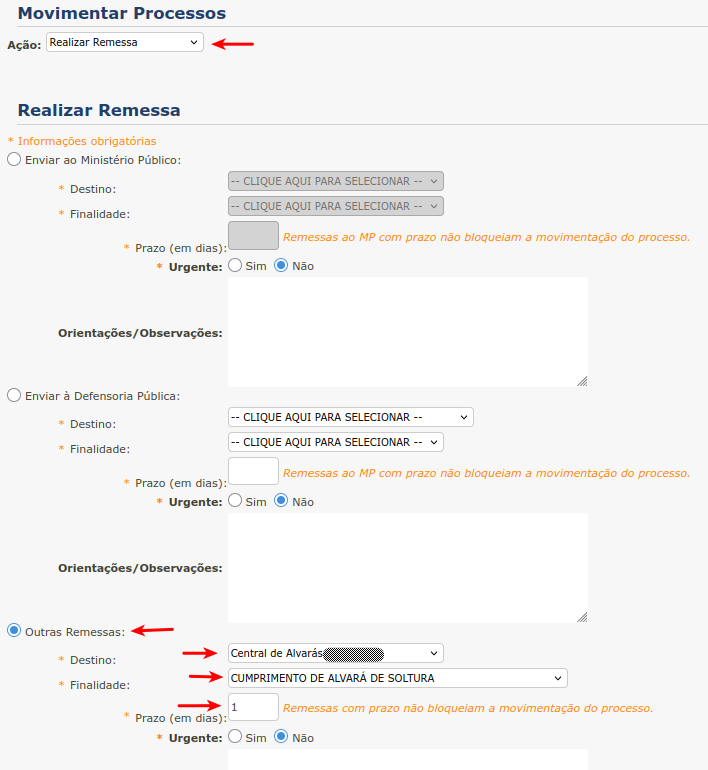

  Campos para a movimentação C Alvaras com finalidade CUMPRIMENTO DE ALVARÁ DE SOLTURA

Agrupadores que utilizam CUMPRIMENTO DE ALVARÁ DE SOLTURA

  - 1 - DOMICILIAR - C Alvaras; NMEM; COMPLEXO; Ciencia MP; Equipe; Ordenar alvara
  - 2 - PROGRESSAO Aberto - C Alvaras; COMPLEXO; Ciencia MP; Declinacao Reu Solto; Ordenar alvara
  - 2 - PROGRESSAO Aberto - C Alvaras; COMPLEXO; Ciencia MP; Equipe; Ordenar alvara

DECISÃO DE BENEFICIO PARA CUMPRIMENTO
_____________________________________

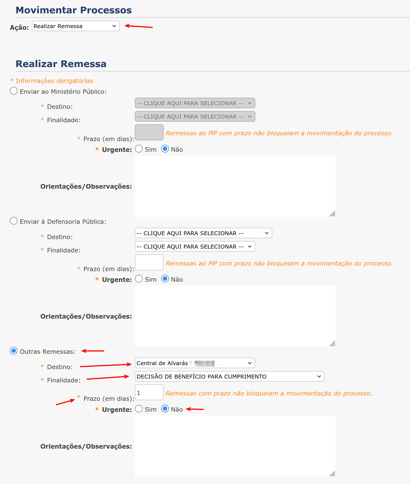

  Campos para a movimentação C Alvaras com finalidade DECISÃO DE BENEFICIO PARA CUMPRIMENTO

Agrupadores que utilizam DECISÃO DE BENEFICIO PARA CUMPRIMENTO

  - 2 - PROGRESSAO S.A - C Alvaras; NMEM; COMPLEXO; Ciencia MP

NMEM (Núcleo de Monitoramento)
------------------------------

O NMEM varia de acordo com o agrupador em que está incluído.

 - **1 - DOMICILIAR - C Alvaras; NMEM; COMPLEXO; Ciencia MP; Equipe; Ordenar alvara**: MONITORAÇÃO ELETRÔNICA, Prazo: 20 dias
 - **1 - SAIDA TEMPORARIA - NMEM; COMPLEXO; Ciencia MP**: MONITORAÇÃO ELETRÔNICA, Prazo: 20 dias
 - **2 - PROGRESSAO S.A - C Alvaras; NMEM; COMPLEXO; Ciencia MP**: INTIMAÇÃO DO SENTENCIADO, Prazo: 30 dias

MONITORAÇÃO ELETRÔNICA
______________________

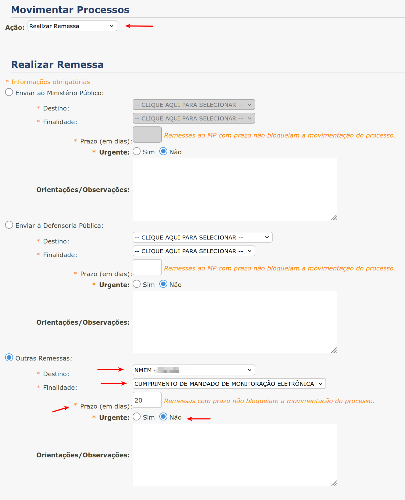

  Campos para a movimentação NMEM (Monitoração Eletrônica)

.. note:: Para o agrupador 1 - SAIDA TEMPORARIA - NMEM; COMPLEXO; Ciencia MP, MONITORAÇÃO ELETRÔNICA é urgente.

INTIMAÇÃO DO SENTENCIADO
________________________

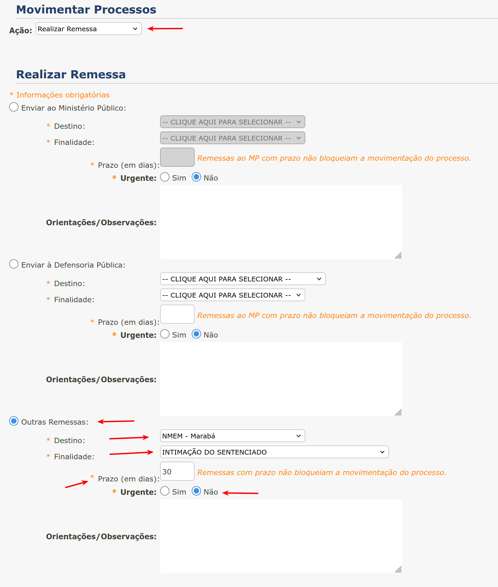

  Campos para a movimentação NMEM (Intimação Sentenciado)

COMPLEXO (Complexo Penitênciário)
---------------------------------

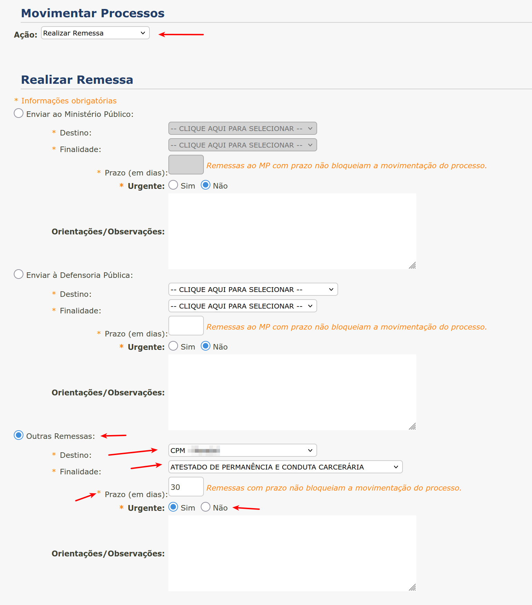

  Campos para a movimentação COMPLEXO

Ciencia MP (Ciência ao Ministério Público)
------------------------------------------

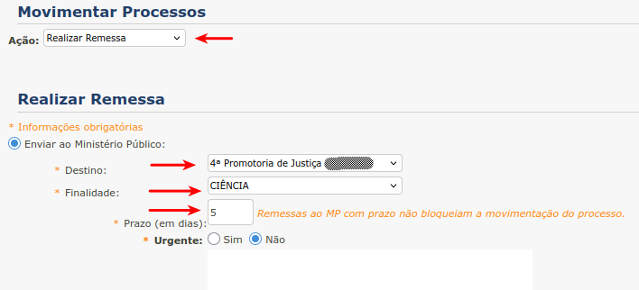

  Campos para a movimentação Ciencia MP

ADVOGADO (Intimar Advogado)
---------------------------

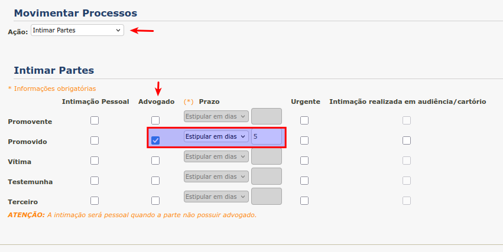

  Campos para a movimentação ADVOGADO

Equipe (Equipe Interdisciplinar)
--------------------------------

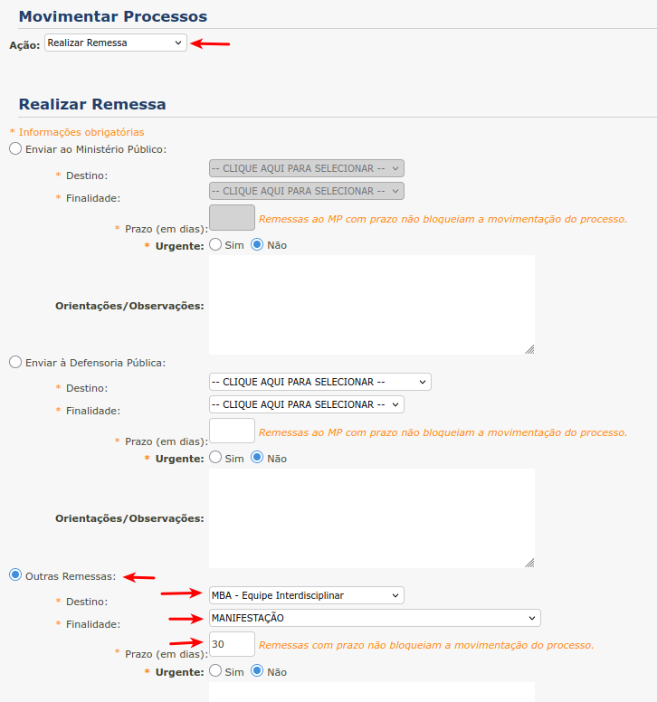

  Campos para a movimentação Equipe

Ciencia DP (Ciência à Defensoria Pública)
-----------------------------------------

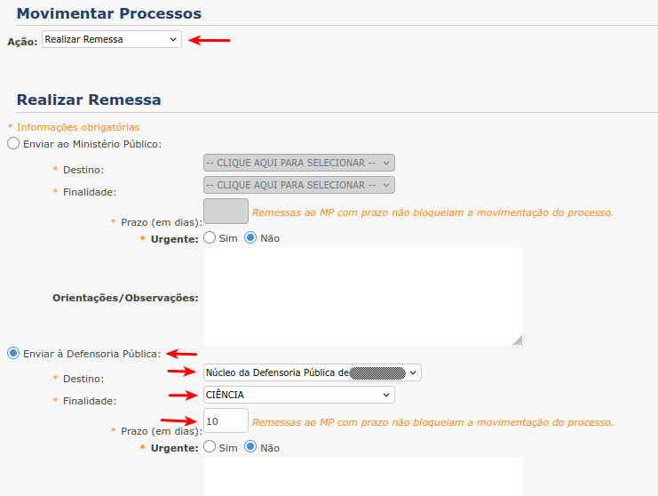

  Campos para a movimentação Ciencia DP

Mandado
-------

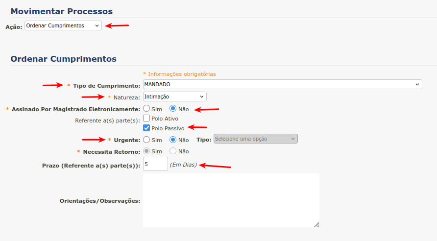

  Campos para a movimentação Mandado

Manifestacao DP (Manifestação à Defensoria Pública)
---------------------------------------------------

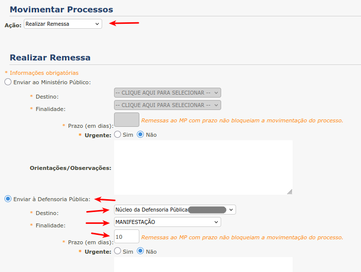

  Campos para a movimentação Manifestacao DP

Manifestacao MP (Manifestação ao Ministério Público)
----------------------------------------------------

  Campos para a movimentação Manifestacao MP

OFICIAR
-------

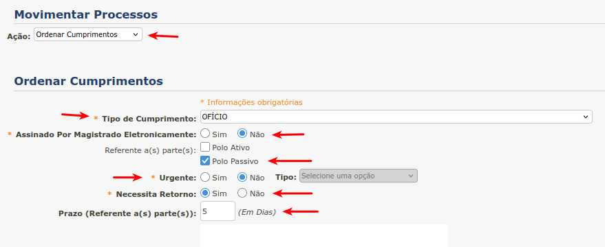

  Campos para a movimentação OFICIAR

Declinacao Reu Solto
--------------------

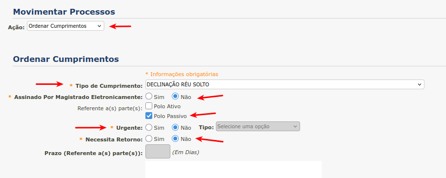

  Campos para a movimentação Declinacao Reu Solto

Ordenar Alvara
--------------

.. figure:: _static/realizar_expedientes_lote/ordenar_alvara.png
  :class: data-fb

  Ordenar Alvará
