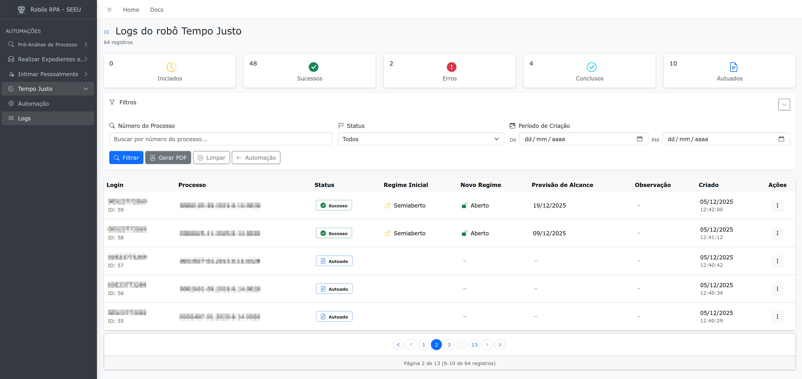

Registros
=========

Todas as automações guardam registros de sua execução para acompanhamento futuro. Mensagens
relacionadas com eventuais erros também são registradas. Os registros da execução de um robô são
usados para gerar relatórios em PDF.

A tela de registros permite filtrar registros de acordo com parâmetros da própria automação, mas em
geral é possível pesquisar pelo número do processo, *status* da execução, como **Iniciado**, ou
**Sucesso** e o período no qual a automação foi executada (data inicial e final).

.. warning:: O botão de ações não está implementado

Segue exemplo da tela de registros para o robô Tempo Justo:

.. note:: As colunas da tabela de registros variam de acordo com a automação.
