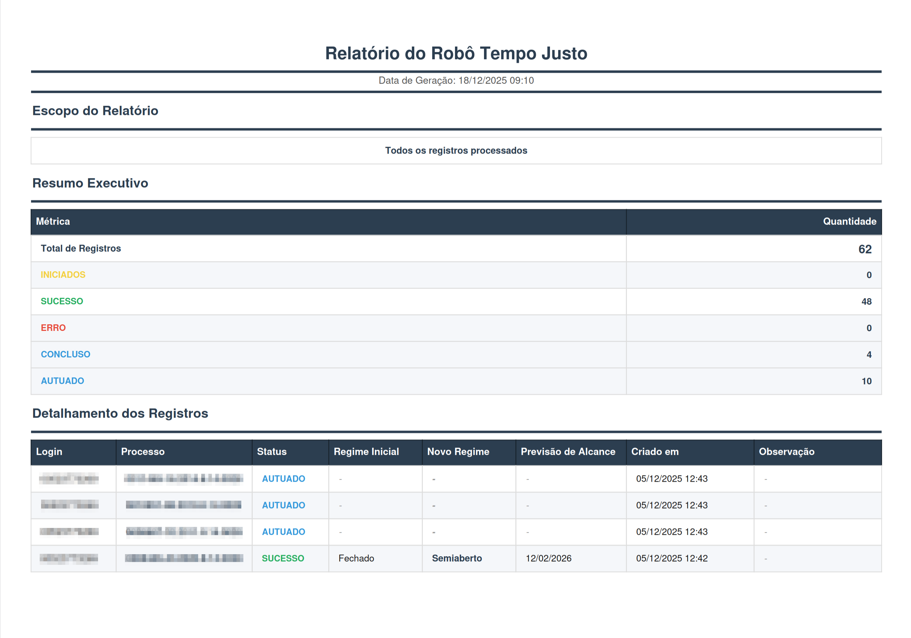

Relatórios
==========

A partir da tela de registros é possível gerar um relatório PDF dos mesmos clicando no botão ``Gerar
PDF``. Um relatório é a representação da tela de registros em arquivo.

.. note:: Os mesmo filtros usados na tela de registros são usados para gerar o relatório PDF.

Exemplo de relatório PDF para o robô Tempo Justo:

