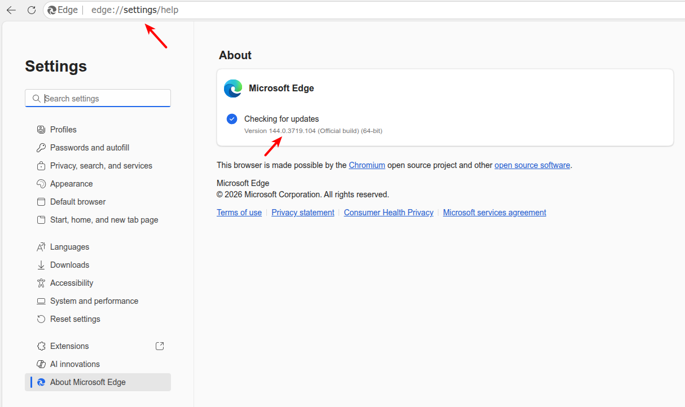
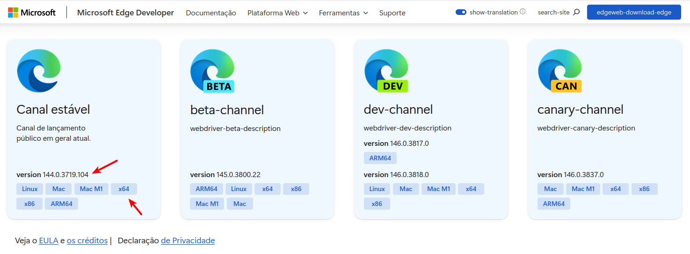
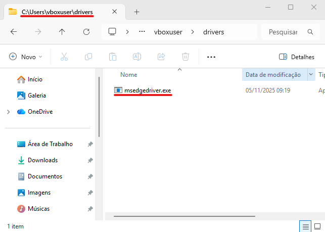
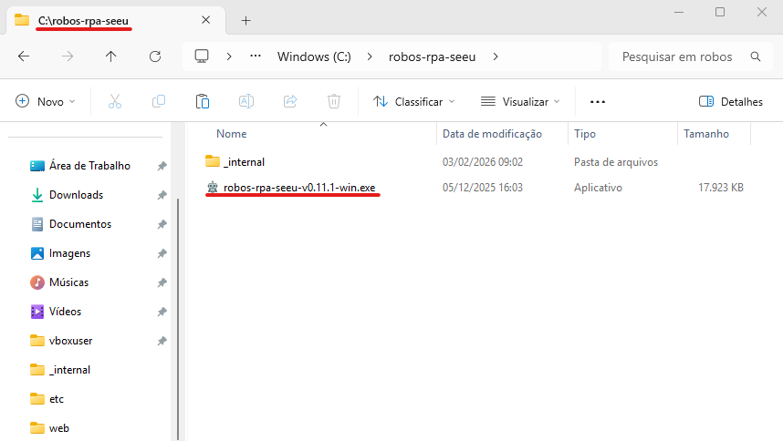

Requisitos
==========

Os requisitos a seguir são necessários para instalar o programa `robos-rpa-seeu.`

- Instalar/atualizar o *Microsoft Edge*.
- Instalar/atualizar o *driver* correspondente a versão do *Microsoft Edge*.
- Instalar/atualizar o programa `robos-rpa-seeu.`

Instalar o Microsoft Edge
-------------------------

O *download* do navegador *Microsoft Edge* pode ser feito no *link* a seguir: `https://www.microsoft.com/pt-br/edge/download <https://www.microsoft.com/pt-br/edge/download>`_

.. note:: O navegador *Microsoft Edge* já vem instalado por padrão em versões mais novas do *Microsoft Windows*.

Instalar o Driver selenium para o Microsoft Edge
------------------------------------------------

O *driver selenium* fornece a *interface* necessária para controlar o navegador, traduzindo as instruções
do programa robôs-rpa-seeu para comandos que o navegador *Microsoft Edge* deva executar.

.. warning:: A versão do *driver selenium* **deve corresponder** a versão do navegador *Microsoft Edge*.

Para verificar a versão do *Microsoft Edge* digite na barra do navegador o endereço `edge://settings/help`.

O *Download* do *driver* pode ser feito no link a seguir: `https://developer.microsoft.com/pt-br/microsoft-edge/tools/webdriver <https://developer.microsoft.com/pt-br/microsoft-edge/tools/webdriver>`_. O *drivers* do canal
estável são recomendados.

.. warning:: Se a versão do *Microsoft Windows* for 32 bits o *driver* deve ser x86. Se for 64 bits, a versão é x64.

Após o *download* descompacte o *driver*, crie uma pasta no seu diretório de usuário chamada `drivers` e coloque o *driver* dentro.

.. note:: O caminho deve ser algo como C:\\Usuários\\nome.sobrenome\\drivers\\msedgedriver.exe

Instalar o programa `robos-rpa-seeu`
------------------------------------

O arquivo contendo o programa `robos-rpa-seeu`` compactado pode ser obtido com a CAU. O arquivo deve
ser descompactado na raiz do sistema.

.. note:: O caminho deve ser algo como C:\\robos-rpa-seeu\

