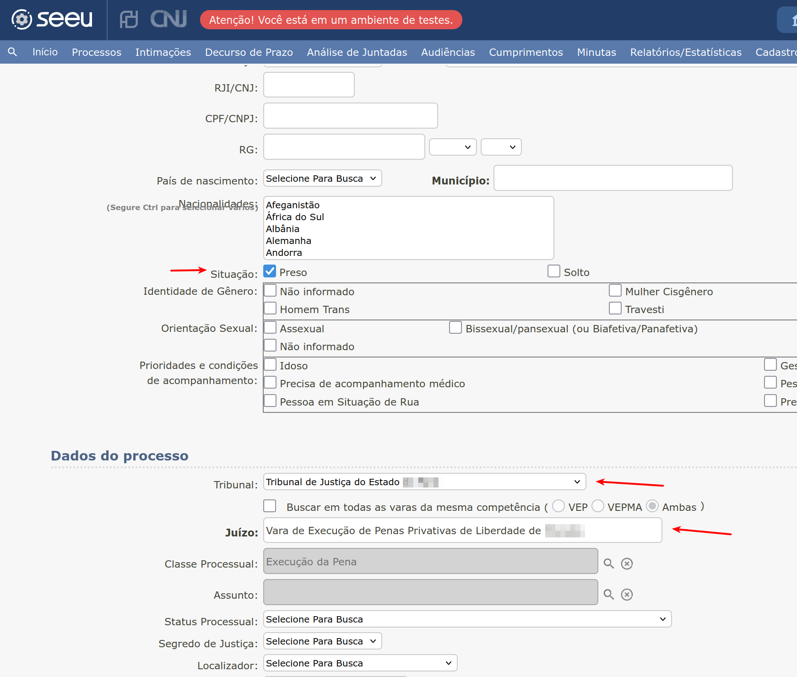
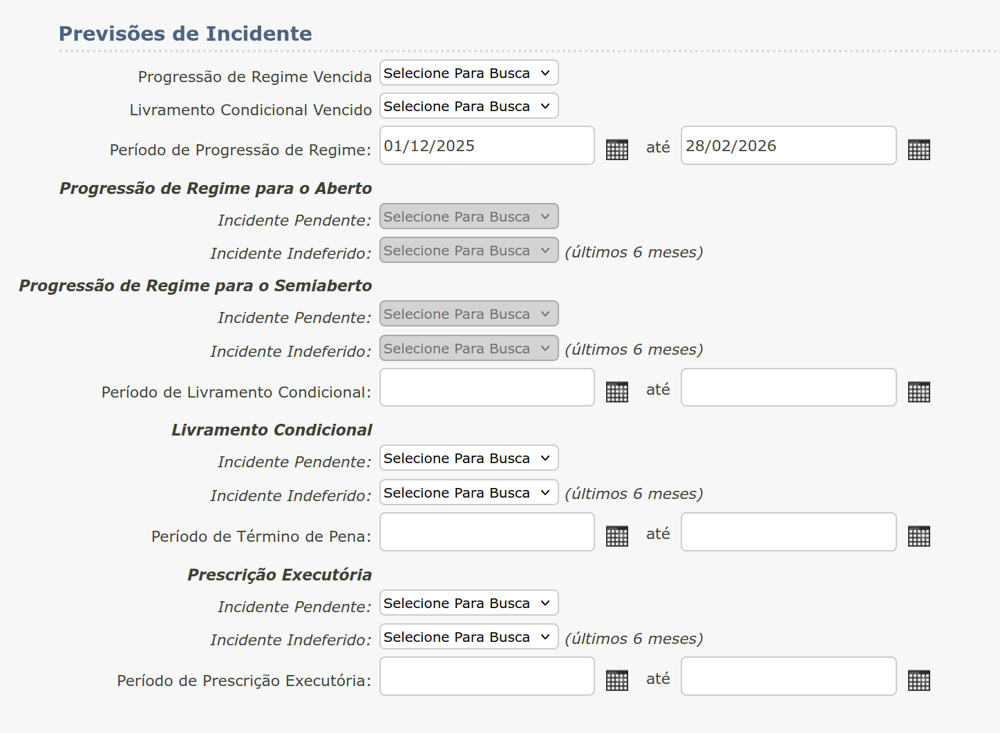
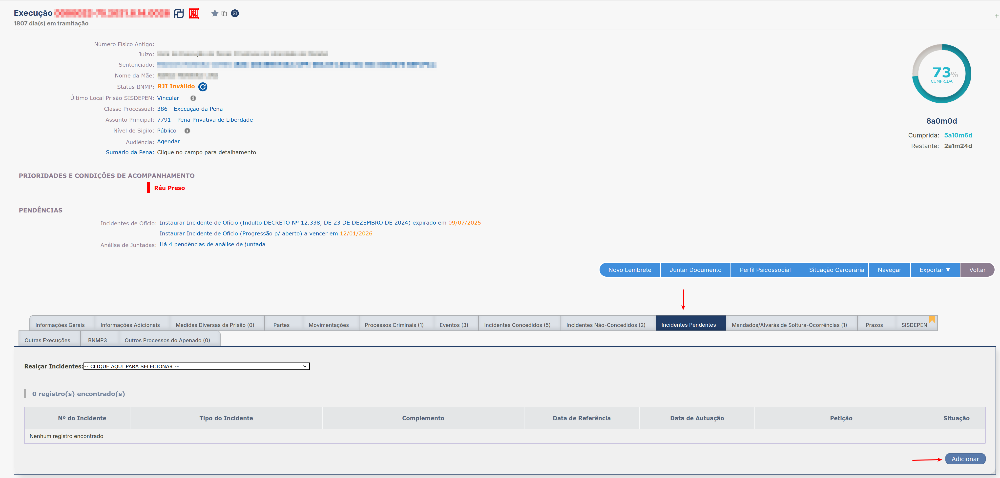
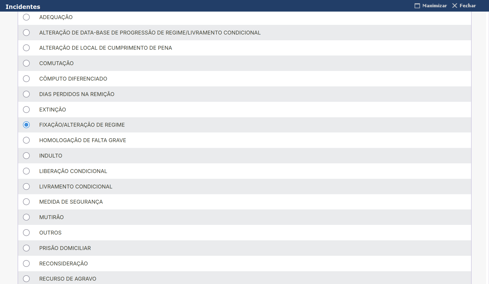
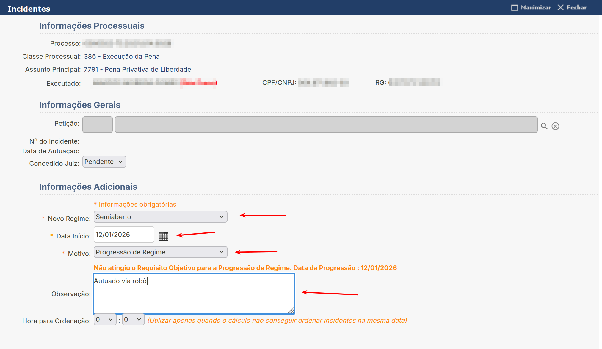
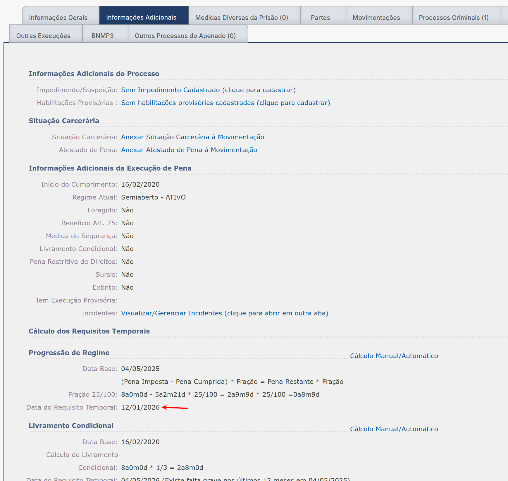
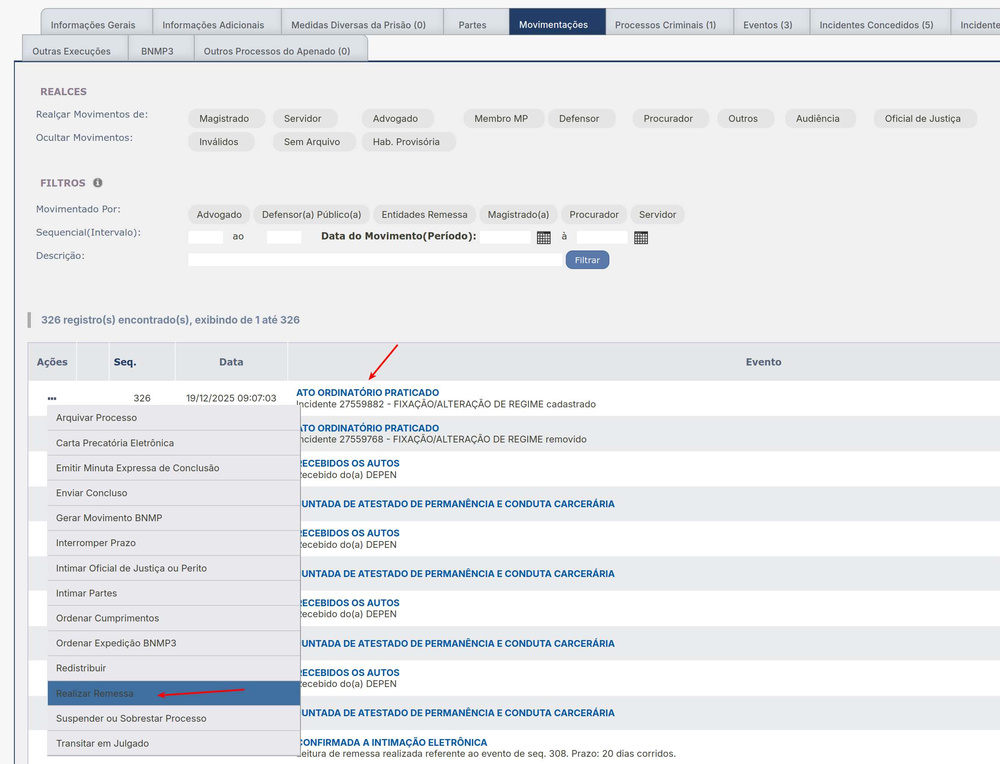
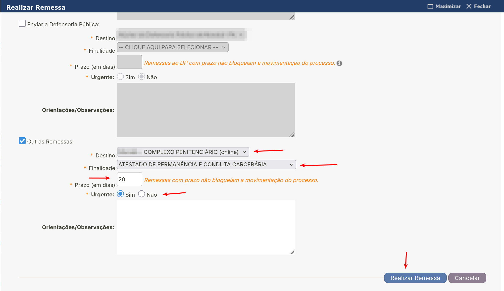

Tempo Justo
===========

O robô Tempo Justo opera em processos da busca penal não conclusos e que não possuam incidentes de
fixação/alteração de regime, utilizando a mesma vara/perfil do usuário logado, no intervalo de três
meses a contar do mês atual.

O robô Tempo Justo então cadastra incidentes de fixação/alteração de regime para esses processos e
em seguida faz uma remessa com finalidade de atestado de permanência carcerária para o complexo
penitenciário correspondente.

Inicialmente o robô acessa o formulário de execução penal pelo menu a seguir:

.. figure:: _static/tempo_justo/menu_execucao_penal.png
    :class: data-fb

Após acessar o formulário de busca, a automação seleciona os seguintes critérios:

.. note:: O tribunal selecionado é o TJPA

.. warning:: O juizo é a mesma vara/unidade da pessoa usuária logada no momento

O intervalo na seção Previsão Incidente é 3 meses a contar do mês referente ao dia atual.

Após o clique no botão pesquisar, o robô executa o procedimento em todos os processos disponíveis na
página. Ao finalizar, o robô clica no botão de paginação, caso esteja disponível e volta a executar
o procedimento nos processos restantes, até o término da execução.

Antes de executar o procedimento do Tempo Justo, a automação verifica se os processos estão
conclusos e guarda os processos em memória para posterior processamento.

.. note:: O robô Tempo Justo opera apenas em processos não-conclusos.

A automação então abre processo a processo em uma nova aba e executa o procedimento de cadastro de
incidente e remessa.

Após clicar na aba incidentes pendentes, o robô clica no botão adicionar e cadastra um novo
incidente caso não haja um incidente de FIXAÇÃO/ALTERAÇÃO DE REGIME já cadastrado.

.. warning:: Caso já exista um incidente de FIXAÇÃO/ALTERAÇÃO DE REGIME cadastrado, o robô pula o
             processo

A automação seleciona o tipo de incidente FIXAÇÃO/ALTERAÇÃO DE REGIME e clica no botão ``Novo
Incidente`` ao final do modal.

O robô preenche o formulário de novo incidente selecionando o novo regime de progressão em função do
processo. Se for fechado, o robô seleciona semiaberto, se for semiaberto, o robô seleciona aberto.

A data de inicio é obtida pela automação a partir da aba informações adicionais, via campo ``Data do Requisito Temporal``.

Após o cadastro do incidente via botão ``Salvar``, o robô clica no menu realizar remessa referente
ao ato ordinatório referente ao cadastro de incidente recém efetuado, na aba Movimentações:

Em seguida a automação preenche os dados da remessa e clica no botão ``Realizar Remessa``
finalizando o procedimento para esse processo.

Essa aba no navegador é fechada e a automação volta para aba contendo a busca penal e continua o
procedimento selecionando o próximo processo não-concluso da listagem. A execução do robô finaliza
após a realização do procedimento em todos os processos não-conclusos em todas as páginas da busca
penal.
